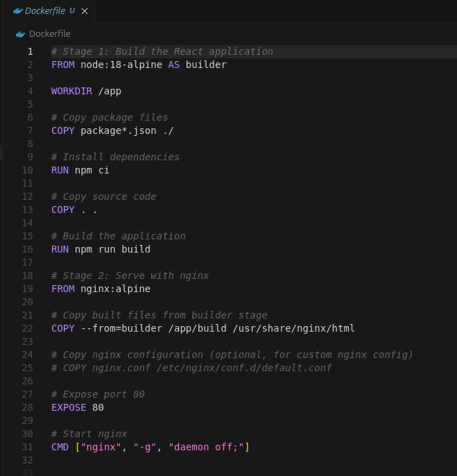
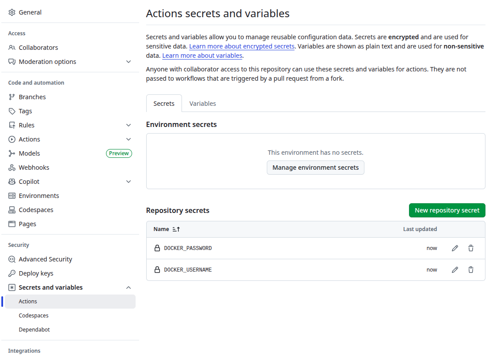
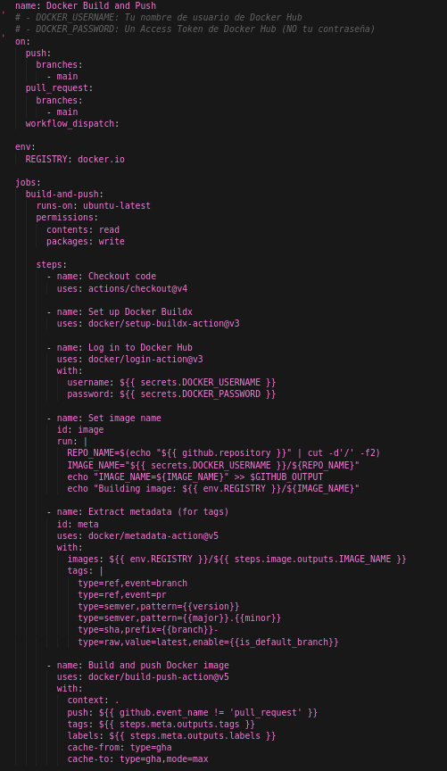
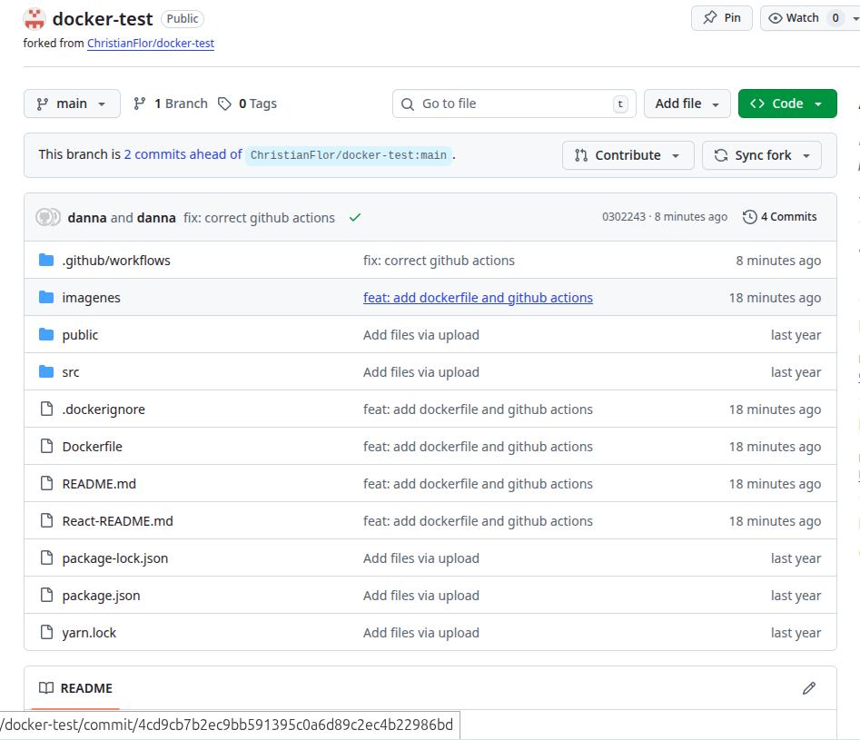
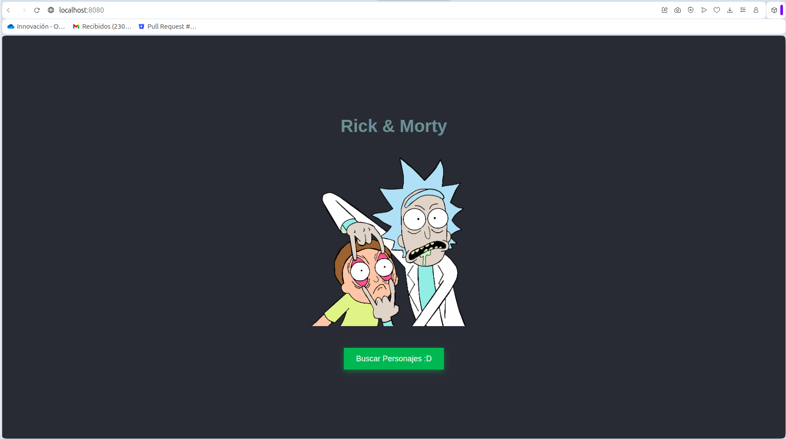

# Taller: Dockerización y CI/CD con GitHub Actions
Danna Valentina López Muñoz A00395625

## Introducción

Este taller tiene como objetivo dockerizar una aplicación React y configurar un pipeline de CI/CD usando GitHub Actions para automatizar la construcción y publicación de imágenes Docker en Docker Hub.

## Objetivos

1. Crear un Dockerfile para optimizar la construcción de la aplicación React
2. Configurar GitHub Secrets para autenticación con Docker Hub
3. Crear un workflow de GitHub Actions que automatice el build y push de imágenes Docker

## Paso 1: Creación del Dockerfile

Se creó un Dockerfile que optimiza el proceso de construcción y reduce el tamaño final de la imagen.



### Características del Dockerfile

**Stage 1: Builder**
- Utiliza `node:18-alpine` como imagen base (ligera y eficiente)
- Instala las dependencias con `npm ci` (más rápido y determinista que `npm install`)
- Construye la aplicación React para producción con `npm run build`

**Stage 2: Production**
- Utiliza `nginx:alpine` como servidor web ligero
- Copia solo los archivos construidos desde el stage anterior
- Expone el puerto 80 para servir la aplicación

### Archivo .dockerignore

Se creó un archivo `.dockerignore` para excluir archivos innecesarios del contexto de Docker, reduciendo el tamaño y mejorando la velocidad de construcción

## Paso 2: Configuración de GitHub Secrets

Para que GitHub Actions pueda autenticarse con Docker Hub, es necesario configurar secretos en el repositorio.



### Pasos para configurar los secretos:

1. **Crear un Access Token en Docker Hub:**
   - Ir a https://hub.docker.com/settings
   - Hacer clic en "New Access Token"
   - Asignar un nombre descriptivo (ej: "github-actions")
   - **Importante:** Copiar el token inmediatamente, ya que solo se muestra una vez

2. **Configurar secretos en GitHub:**
   - Ir al repositorio en GitHub
   - Navegar a: **Settings → Secrets and variables → Actions**
   - Hacer clic en "New repository secret"
   - Crear dos secretos:
     - `DOCKER_USERNAME`: Tu nombre de usuario de Docker Hub
     - `DOCKER_PASSWORD`: El Access Token creado (NO usar la contraseña normal)

**Nota:** Docker Hub requiere un Access Token para autenticación desde aplicaciones externas. La contraseña normal no funcionará y generará un error de "insufficient_scope".

## Paso 3: Creación del Workflow de GitHub Actions

Se creó un workflow completo que automatiza el proceso de construcción y publicación de la imagen Docker.



### Estructura del Workflow

El archivo `.github/workflows/docker-build-push.yml` contiene:

#### Triggers (Disparadores)
- Push a la rama `main`
- Pull requests a la rama `main`
- Ejecución manual (`workflow_dispatch`)

#### Jobs y Steps

**1. Checkout code**
```yaml
- name: Checkout code
  uses: actions/checkout@v4
```
Descarga el código del repositorio.

**2. Set up Docker Buildx**
```yaml
- name: Set up Docker Buildx
  uses: docker/setup-buildx-action@v3
```
Configurar Docker Buildx para builds avanzados con soporte multi-plataforma.

**3. Log in to Docker Hub**
```yaml
- name: Log in to Docker Hub
  uses: docker/login-action@v3
  with:
    username: ${{ secrets.DOCKER_USERNAME }}
    password: ${{ secrets.DOCKER_PASSWORD }}
```
Autenticar con Docker Hub usando los secretos configurados.

**4. Set image name**
```yaml
- name: Set image name
  id: image
  run: |
    REPO_NAME=$(echo "${{ github.repository }}" | cut -d'/' -f2)
    IMAGE_NAME="${{ secrets.DOCKER_USERNAME }}/${REPO_NAME}"
    echo "IMAGE_NAME=${IMAGE_NAME}" >> $GITHUB_OUTPUT
```
Extraer dinámicamente el nombre del repositorio y construye el nombre de la imagen.

**5. Extract metadata**
```yaml
- name: Extract metadata (for tags)
  id: meta
  uses: docker/metadata-action@v5
  with:
    images: ${{ env.REGISTRY }}/${{ steps.image.outputs.IMAGE_NAME }}
    tags: |
      type=ref,event=branch
      type=ref,event=pr
      type=semver,pattern={{version}}
      type=semver,pattern={{major}}.{{minor}}
      type=sha,prefix={{branch}}-
      type=raw,value=latest,enable={{is_default_branch}}
```
Generar tags automáticos para la imagen basados en:
- Nombre de la rama
- Pull request
- Versión semántica
- SHA del commit
- Tag `latest` para la rama principal

**6. Build and push Docker image**
```yaml
- name: Build and push Docker image
  uses: docker/build-push-action@v5
  with:
    context: .
    push: ${{ github.event_name != 'pull_request' }}
    tags: ${{ steps.meta.outputs.tags }}
    labels: ${{ steps.meta.outputs.labels }}
    cache-from: type=gha
    cache-to: type=gha,mode=max
```
Construir y publicar la imagen Docker con:
- Cache de GitHub Actions para builds más rápidos
- Push solo en eventos de push (no en pull requests)
- Múltiples tags automáticos

## Paso 4: Resultados

Una vez configurado todo, el workflow se ejecuta automáticamente en cada push a la rama `main`.



- La imagen Docker se construye exitosamente
- La imagen se publica en Docker Hub con múltiples tags
- El proceso utiliza cache para optimizar tiempos de construcción

### Verificar la imagen publicada:

```bash
# Pull de la imagen
docker pull danna3009/docker-test:latest

# Ejecutar el contenedor
docker run -d -p 8080:80 danna3009/docker-test:latest
```



Este taller demostró cómo:
- Dockerizar una aplicación React de forma eficiente
- Configurar CI/CD con GitHub Actions
- Automatizar el proceso de construcción y publicación de imágenes Docker

El pipeline configurado permite que cada cambio en el código se construya y publique automáticamente, facilitando el proceso de despliegue continuo.